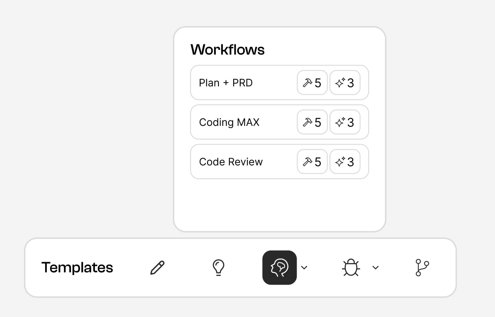

<p align="center">
  <picture align="center">
    <!-- <source media="(prefers-color-scheme: dark)" srcset="./public/banner.png"> -->
    
  </picture>
</p>

<p align="center">
  <strong>
  <em>mcpn.ai</em> helps you create, organize, and share AI workflows and prompts.
 <br>Like a dynamic prompt library you can share & version across MCP tools and servers for specific tasks.
  </strong>
</p>

<p align="center">
  
  
  
<br />
<strong>Created by</strong><br />
<a href="https://twitter.com/tedx_ai">
  
</a>
<a href="https://twitter.com/kregenrek">
  
</a>
</p>

## Usage

Basic Example

<table>
<tr>
  <td style="width:50%; vertical-align:top;">

```yaml
plan_prd:
  description: "Create a product requirements..."
  prompt: |
    You are an expert product manager/business
    analyst and are now entering "PRD Mode"
    Begin by deeply reflecting upon the notes,
    requirements and images provided...
  tools: createPRD, createStoriesFromPRD, createRoadmap

coding_max:
  description: "Highly effective Coding Agent"
  prompt: |
    You are now entering "Developer Mode" -
    deeply reflect upon the changes being asked and
    analyze existing code to map the full scope...
  tools: getConsoleLogs, getErrorLogs, getLinter

  ...
```

  </td>
  <td style="width:50%; vertical-align:top;">
    
  </td>
</tr>
</table>

Workflows MCP (mcpn) are the building blocks of software development, an orchestration of multiple MCP servers and prompts.

Think of it like a dynamic prompting library that you can easily share and version control through yaml files that also lets you define how to best use many MCP tools across many MCP servers for specific tasks.

## Installation

Install the MCP server into an MCP client using the following command or JSON:

```bash
npx -y mcpn@latest init
```

If using JSON in Cursor to setup your MCP server, you can use the following config:

```json
{
  "mcpServers": {
    "workflows-mcp": {
      "command": "npx",
      "args": ["-y", "mcpn@latest server"]
    }
  }
}
```

## Documentation

Documentation: [https://mcpn.ai](https://mcpn.ai)

## Examples

... TBD

## License

... TBD

## Links

... TBD

========================================================================

Move below to documentation

## Overview

The key to effective MCP use is to know when/how to use the right tools. Workflows MCP helps make this process MUCH easier and faster. With Workflows MCP, you can:

✅ Combine prompts with MCP servers into reusable & easy to edit/share/organize workflows

✅ Trigger workflows with custom commands like: "enter debugger mode" or "use thinking mode"

✅ Define custom strategies for how to use many tools in a workflow (sequential or situational/dynamic)

✅ Easily onboard your team to the best prompts + ways to use many MCP tools w/ version control.

_We also provide a number of useful presets to get you started 🫡_

### So why use this?

The goal of this project is to turn prompts into programmable tools and rules for AI in a code editor more deterministic while reducing the overall amount of token use across all requests. Since stuffing a global set of rules for AI can eat up your context window, using MCP to route to prompts and workflows can help reduce the overall amount of tokens used across all requests.

Workflows for MCP are also **incredibly** powerful! For instance, you can create an **"production incident workflow"** tool that has a special system prompt to reason about an incident in a particular way and then use a series of tools in a specific order to analyze + potentially resolve the incident. This may involve things like:

- Gathering logs across many MCP tools for Kubernetes, Cloudwatch, Splunk, etc
- Checking Github issues or a vector database for similar issues in the past
- Perform web searches for useful information on the web
- Analyze your code with all the gathered context from the prior steps
- Write a detailed incident report with all the context from the prior steps
- Gather input from you to better understand the problem space
- Implement a fix for issue if possible

And since these workflows are all defined in YAML and can be referenced from anywhere on your machine, you can **easily** rally your team around when/how to use the best prompts and sequences of MCP tools for specific tasks 🦾

## Features

### 📝 Custom Configuration

- Load custom configs from multiple YAML files in a `.workflows` or `.mcp-workflows` directory
- Easily save these yaml files to a git repo and share with your team
- Since MCP servers can have custom configs for each project, you can easily pick and choose which configs to use for each project - setting up custom workflow folders for each project
- Support for typed parameter inputs in tool configurations makes building custom MCP prompting tools a breeze

### 🚀 Ready-to-Use Presets

Workflows MCP includes multiple preset workflow modes out of the box for thinking, coding, and github use:

**Thinking**: General purpose tools to improve reasoning on any task

- **Thinking Mode**: Reflect on thoughts and produce structured analysis (inspired by Anthropic's latest research into thinking tools)
- **Deep Thinking Mode**: Comprehensive multi-perspective analysis with detailed reflections

**Coding**: Universally applicable tools for common coding tasks
Universally applicable tools for common coding tasks

- **Debugger Mode**: Systematic multi-step reasoning and debugging with hypothesis creation, telemetry gathering and testing
- **Architecture Mode**: System design prompt with tradeoff analysis and implementation planning
- **Planner Mode**: Systematic code change planning with codebase analysis
- **PRD Mode**: Structured product requirements documentation for features, user stories and spike analysis
- **Save Note**: Document ongoing work with comprehensive progress tracking. Useful for when you need to step away for a bit and want to save your thoughts for later.

**GitHub**: Tools to simplify common GitHub tasks. Great for anyone who is a beginner with source control using Git and the Github CLI

- **PR Review Mode**: Comprehensive pull request analysis with security considerations
- **PR Creation Mode**: Structured PR creation process using GitHub CLI
- **Create Branch**: Smart branch creation with contextual naming
- **Save Changes**: Systematic git commit and push workflow

## Installation

Install the MCP server into an MCP client using the following command or JSON:

```bash
npx -y mcpn@latest init
```

If using JSON in Cursor to setup your MCP server, you can use the following config:

```json
{
  "mcpServers": {
    "workflows-mcp": {
      "command": "npx",
      "args": ["-y", "mcpn@latest server"]
    }
  }
}
```

To provide custom configurations, you can use the `--config` flag to point to a directory containing YAML configuration files. The directory must be named `.workflows` or `.mcp-workflows` as so:

```bash
npx mcpn@latest server --config /path/to/.workflows
```

If you want to enable presets, you can use the `--preset` flag to specify which presets to load:

```bash
npx mcpn@latest server --preset thinking,coding,github
```

Here's what this would look like in a Cursor config all combined:

```json
{
  "mcpServers": {
    "workflows-mcp": {
      "command": "npx",
      "args": [
        "mcpn@latest server",
        "--config",
        "/path/to/.workflows",
        "--preset",
        "thinking,coding"
      ]
    }
  }
}
```

Note:

- _If you update your config, you must refresh the MCP tool_
- _If refreshing doesn't work, make sure your config is valid YAML_
- _If you're still having issues, then try removing & renaming the MCP tool in your client_
- _If no config or preset is provided, it will default to using the `thinking` preset._
- _If you're still not able to get this working, open an issue ticket_

## Custom Workflow Configs

Create a `.workflows` or `.mcp-workflows` directory in your project and add YAML configuration files with any name (must end with `.yaml` or `.yml`). These configurations will also override the preset defaults if named the same as a preset tool.

### Example Configuration Files

#### Basic Workflow Configuration

```yaml
workflow_name:
  description: "Description of what this workflow does"
  prompt: |
    Enter your multi-line
    prompt here like this
  toolMode: "situational" # can be omitted as it's the default
  tools: "analyzeLogs, generateReport, validateFindings"
```

#### Tools Configuration Styles

You can define tools in several ways.

Here's an example of a tool that debugs a problem in a codebase with tools used situationally / as needed:

```yaml
web_debugger_mode:
  description: Debug my codebase my web application with browser logs and BrowserTools MCP
  prompt: |
    Deeply reflect upon all of this and think about why this isn't working. Theorize 4-6 different possible sources of the problem.

    Then, deeply reason about the root cause and distill your theories down to the 1-2 most probable sources of the problem before suggesting next steps.
  tools: getConsoleLogs, getConsoleErrors, getNetworkLogs, getNetworkErrors, takeScreenshot
```

This will return the following MCP response:

```
Deeply reflect upon all of this and think about why this isn't working. Theorize 4-6 different possible sources of the problem.


## Available Tools
Use these tools as needed to complete the user's request:

- getConsoleLogs
- getConsoleErrors
- getNetworkLogs
- getNetworkErrors
- takeScreenshot

After using each tool, return a 'Next Steps' section with a list of the next steps to take / remaining tools to invoke along with each tool's prompt/description and 'optional' flag if present.
```

#### Parameter Injection

A powerful feature is the ability to inject parameters into your prompts using the `{{ parameter_name }}` syntax:

```yaml
custom_mode:
  description: "Workflow with parameter injection"
  parameters:
    thought:
      type: "string"
      description: "A thought to deeply reflect upon"
      required: true
    idea:
      type: "string"
      description: "An additional idea to consider"
  prompt: |
    Deeply reflect upon the provided thought.
    Here's the thought: {{ thought }}

    Additional idea to consider: {{ idea }}

    Reflect upon the implications/tradeoffs it may have as it relates to my current goals.
```

Parameters are automatically validated based on their type definitions and injected into your prompts at runtime.

#### Sequential Tool Configuration

In sequential mode, tools are executed in a specific order:

```yaml
web_debugger_mode:
  description: Debug my codebase my web application with browser logs and BrowserTools MCP
  prompt: |
    Deeply reflect upon all of this and think about why this isn't working. Theorize 4-6 different possible sources of the problem.
  toolMode: sequential
  tools: getConsoleLogs, getConsoleErrors, getNetworkLogs, getNetworkErrors, takeScreenshot
```

This will return the following MCP response:

```
Deeply reflect upon all of this and think about why this isn't working. Theorize 4-6 different possible sources of the problem.

## Available Tools
If all required user input/feedback is acquired or if no input/feedback is needed, execute this exact sequence of tools to complete this task:

1. getConsoleLogs
2. getConsoleErrors
3. getNetworkLogs
4. getNetworkErrors
5. takeScreenshot

After using each tool, return a 'Next Steps' section with a list of the next steps to take / remaining tools to invoke along with each tool's prompt/description and 'optional' flag if present.
```

### Advanced Tool Configuration

Includes ability to define prompts for each tool and an optional flag to indicate if the tool is optional or not in the sequence:

```yaml
deep_thinking_mode:
  description: Reflect on a thought and produce a reflection/new set of thoughts
  parameters:
    thought:
      type: string
      description: A thought to deeply reflect upon
      required: true
  prompt: |
    Deeply reflect upon the provided thought.
    Reflect upon the implications/tradeoffs it may have as it relates to my current goals, challenges and our conversation.
    Do not change anything in our system, just return some thoughts/considerations/analysis based on your reflection of the provided thought.
  toolMode: "sequential"
  tools:
    analyze_thought: analyze a previously generated thought
    explore_perspectives: think about additional perspectives given the analysis
    apply_findings:
      propmt: implement the findings of the analysis
      optional: true
```

### Configuration Structure

Each YAML file should contain a mapping of tool names to their configuration. Configurations can be loaded from two sources:

1. Internal presets (located in the `presets` directory)
2. User-defined configurations (in `.workflows` or `.mcp-workflows` directory)

### Basic Tool Configuration

For each tool, you can specify:

- `name`: Optional name override for the registered tool (default is the config key)
- `description`: Description of what the workflow/tool does
- `prompt`: Custom prompt (completely replaces default prompt if workflow name is also an active preset)
- `context`: Additional context to append to the prompt (does not replace default prompt for presets)
- `tools`: Array or object of tools available in this mode, with flexible definition styles
- `toolMode`: Mode of tool execution, either "sequential" or "situational" (defaults to "situational")
- `parameters`: Object mapping of parameters as input to the tool - supports template injection using {{ parameter_name }}
- `disabled`: Boolean to disable the tool

### Input Parameter Configuration

Tools can accept typed parameters that an MCP Client / agent can provide to improve reasoning capabilities for your prompt/workflow. These inputs are automatically converted to Zod schemas for validation and type safety. Each parameter is defined with the following properties:

| Property      | Description                                                            | Required                 |
| ------------- | ---------------------------------------------------------------------- | ------------------------ |
| `type`        | Data type: "string", "number", "boolean", "array", "object", or "enum" | Yes                      |
| `description` | Human-readable description of the parameter                            | No                       |
| `required`    | Whether the parameter is required                                      | No (defaults to `false`) |
| `default`     | Default value if not provided                                          | No                       |
| `enum`        | Array of valid values (required for `enum` type only)                  | Yes (for `enum` type)    |
| `items`       | For array types, defines the type of items in the array                | No                       |
| `properties`  | For object types, defines the properties of the object                 | No                       |

#### Example Input Parameter Types

```

```
